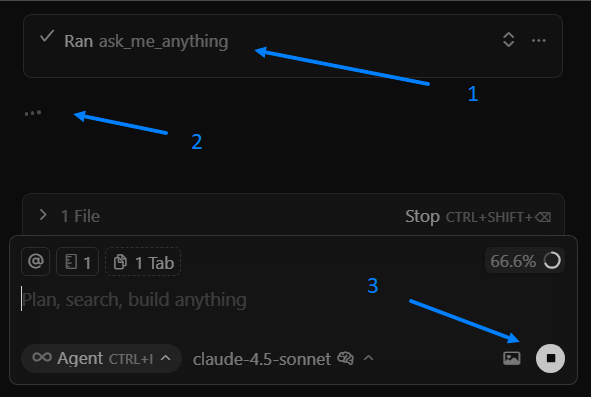

**Languages:** [English](README.md) | [Русский](README_ru.md)

# MCP Dialog

Диалоговый инструмент для взаимодействия с AI (IDE Cursor AI или другими платформами).

## О проекте

MCP Dialog позволяет после выполнения запроса ИИ задать ему уточняющий вопрос.

MCP имеет защиту от завершения диалога по таймауту, для этого он перезапускает MCP через 5 минуты, можно задать любое время.

## Основные возможности

- 🔄 **Бесконечная беседа** - В рамках одного диалога можно задать уточняющий вопрос, продолжая беседу
- 🕒 **Таймаут 600 секунд** - защита от таймаута (перезапуск MCP)
- 🎨 **Минимализм** - компактный и простой интерфейс
- ⚙️ **Гибкая настройка** - возможность изменить параметры, язык и сообщения

## Быстрый старт

1. Скопируйте все файлы в директорию проекта
2. Убедитесь что установлен Python 3.6+ с библиотекой `fastmcp`
3. Подключите и включите MCP в IDE
4. Добавьте правило для ИИ

## Использование в Cursor

1. Задайте любой запрос ИИ, например: Сколько будет 2+2?
2. После ответа ИИ, будет вызвано диалоговое окно MCP Dialog
3. Вы можете дать новое задание ИИ, если отправить пустой ответ, то ИИ расскажет анекдот про ИИ.
4. Если MCP не получил задание от пользователя, то он перезапускает MCP, при этом диалоговое окно открыто, и вы можете отправить запрос в любое время.

## Детали установки смотрите в файле
[Установка](install_ru.md)

## Баг Cursor Trial

Если завершить диалог, когда ИИ пишет или думает, то это сделает общение с ИИ полностью бесплатным.
1. В mcp окне отправили пусто сообщение
2. Видите 3 точки
3. Нажимаете стоп

## Техническая информация

### Системные требования

- Python 3.6+
- tkinter (обычно входит в стандартную поставку Python)
- fastmcp
- Windows/Linux/macOS

### Архитектура

- **FastMCP** - фреймворк для создания MCP серверов
- **tkinter** - GUI библиотека для диалогового окна  
- **threading** - многопоточность для неблокирующего интерфейса
- **JSON** - формат обмена данными через файловую систему

### Безопасность

- Нет сетевых соединений или внешних зависимостей

## Лицензия

Открытый исходный код. Используйте и модифицируйте по своему усмотрению.

